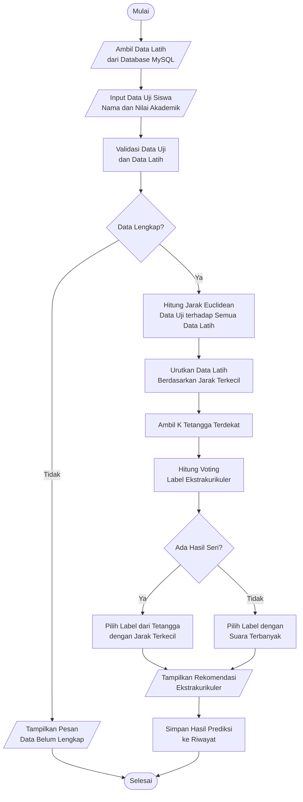

# Flowchart Algoritma K-Nearest Neighbors

## Narasi Subbab

Berdasarkan algoritma K-Nearest Neighbors yang telah dijelaskan di atas, langkah-langkah prosesnya digambarkan dalam sebuah flowchart. Flowchart ini menunjukkan proses perhitungan KNN mulai dari pengambilan data latih, input data uji, perhitungan jarak Euclidean, pengurutan jarak, penentuan K tetangga terdekat, hingga menghasilkan rekomendasi ekstrakurikuler. Flowchart proses algoritma KNN dapat dilihat pada gambar 4.1 berikut:

## Flowchart

## Caption Gambar

**Gambar 4.1 Flowchart Algoritma K-Nearest Neighbors**

## Versi Teks Isi Flowchart

1. Mulai.
2. Sistem mengambil data latih dari database MySQL.
3. Siswa atau admin memasukkan data uji berupa nama siswa dan nilai akademik.
4. Sistem melakukan validasi terhadap data uji dan data latih.
5. Jika data belum lengkap, sistem menampilkan pesan kesalahan.
6. Jika data lengkap, sistem menghitung jarak Euclidean antara data uji dan seluruh data latih.
7. Sistem mengurutkan data latih berdasarkan jarak terkecil.
8. Sistem mengambil sejumlah K tetangga terdekat.
9. Sistem melakukan voting berdasarkan label ekstrakurikuler pada tetangga terdekat.
10. Jika terdapat hasil seri, sistem memilih label dari tetangga dengan jarak terkecil.
11. Jika tidak terdapat hasil seri, sistem memilih label dengan suara terbanyak.
12. Sistem menampilkan rekomendasi ekstrakurikuler.
13. Sistem menyimpan hasil prediksi ke riwayat.
14. Selesai.
