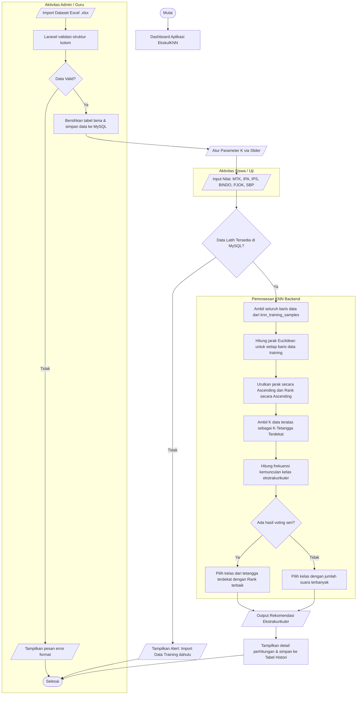

# LAPORAN LENGKAP PENGEMBANGAN SISTEM REKOMENDASI EKSTRAKURIKULER DENGAN METODE K-NEAREST NEIGHBOR (KNN)

**Judul Skripsi:** 
*Implementasi Algoritma K-Nearest Neighbor (KNN) dalam Merekomendasikan Ekstrakurikuler yang Tepat bagi Siswa MTsN 2 Bayang Berbasis Web*

---

> [!NOTE]
> Laporan ini disusun secara akademis untuk membantu penyusunan draf **Bab I sampai Bab V** skripsi Anda. Dokumen ini mendeskripsikan secara utuh keselarasan sistem dengan rumusan masalah penelitian, skema database MySQL, arsitektur framework Laravel, serta simulasi matematis algoritma KNN secara nyata menggunakan dataset siswa.

---

## DAFTAR ISI
1. **BAB I: PENDAHULUAN**
   - 1.1 Latar Belakang Masalah
   - 1.2 Rumusan Masalah
   - 1.3 Batasan Masalah
   - 1.4 Tujuan Penelitian
   - 1.5 Manfaat Penelitian
2. **BAB II: LANDASAN TEORI**
   - 2.1 Konsep Klasifikasi & Rekomendasi
   - 2.2 Algoritma K-Nearest Neighbor (KNN)
   - 2.3 Jarak Euclidean (Euclidean Distance)
   - 2.4 Metode Tie-Breaking dengan Peringkat Kelas (Rank)
   - 2.5 Framework Laravel dan Database MySQL
3. **BAB III: ANALISIS DAN PERANCANGAN SISTEM**
   - 3.1 Analisis Kebutuhan Sistem
   - 3.2 Analisis Data dan Atribut Penilaian
   - 3.3 Perancangan Database (Entity-Relationship & Skema Tabel)
   - 3.4 Perancangan Alur Kerja (Flowchart Sistem)
4. **BAB IV: IMPLEMENTASI KODE PROGRAM (BACKEND & UI)**
   - 4.1 Struktur Logika KnnController.php
   - 4.2 Pemrosesan Parsing File Excel secara Mandiri (Custom Parser)
   - 4.3 Logika Utama Perhitungan Jarak dan Voting
   - 4.4 Rancangan Antarmuka Pengguna (Glassmorphism & Responsive Web)
5. **BAB V: SIMULASI PERHITUNGAN MATEMATIS KNN SECARA NYATA**
   - 5.1 Dataset Latih (Training Data)
   - 5.2 Contoh Kasus Data Uji (Testing Data)
   - 5.3 Langkah-Langkah Perhitungan Jarak Euclidean
   - 5.4 Pengurutan Tetangga Terdekat & Pengambilan K
   - 5.5 Proses Voting dan Keputusan Rekomendasi
6. **BAB VI: KESIMPULAN DAN SARAN**
   - 6.1 Kesimpulan
   - 6.2 Saran Pengembangan

---

## BAB I: PENDAHULUAN

### 1.1 Latar Belakang Masalah
Ekstrakurikuler merupakan kegiatan non-akademik di sekolah yang bertujuan untuk mengembangkan minat, bakat, kepribadian, serta kemampuan sosial siswa di luar kurikulum wajib. Pada MTsN 2 Bayang, pemilihan ekstrakurikuler seringkali dilakukan secara subjektif oleh siswa tanpa mempertimbangkan keselarasan dengan potensi akademik atau karakteristik diri mereka. Banyak siswa memilih suatu kegiatan hanya karena mengikuti pilihan teman sebaya atau kurangnya pemahaman tentang bidang mana yang paling sesuai dengan profil kemampuan akademis mereka. Akibatnya, tingkat partisipasi siswa tidak maksimal, bahkan terjadi kasus di mana siswa merasa salah memilih dan tidak menuntaskan kegiatan tersebut.

Untuk mengatasi permasalahan tersebut, dibutuhkan sebuah sistem pendukung keputusan rekomendasi ekstrakurikuler yang dapat memetakan potensi akademis siswa secara objektif. Kemampuan akademis siswa yang direpresentasikan melalui nilai-nilai mata pelajaran rapor (Matematika, IPA, IPS, Bahasa Indonesia, PJOK, dan Seni Budaya) memiliki korelasi tidak langsung terhadap kecenderungan bakat siswa. Sebagai contoh, siswa dengan nilai PJOK yang sangat tinggi cenderung lebih cocok diarahkan ke ekstrakurikuler olahraga seperti Voli atau Basket, sedangkan siswa dengan nilai Seni Budaya yang menonjol lebih tepat diarahkan ke bidang Musik atau Seni Tari.

Dalam penelitian ini, diimplementasikan algoritma **K-Nearest Neighbor (KNN)** untuk mengklasifikasikan rekomendasi ekstrakurikuler bagi siswa baru. KNN dipilih karena kemampuannya dalam melakukan klasifikasi berdasarkan kemiripan karakteristik (nilai rapor) terhadap data historis siswa yang sudah aktif berpartisipasi dalam kegiatan ekstrakurikuler (data training). Sistem dibangun menggunakan framework **Laravel** dan database **MySQL** untuk menjamin keamanan, kecepatan pemrosesan data di sisi backend, serta kenyamanan antarmuka bagi guru pembimbing dan siswa.

### 1.2 Rumusan Masalah
Berdasarkan latar belakang di atas, rumusan masalah penelitian ini adalah:
1. Bagaimana merancang dan membangun sistem rekomendasi ekstrakurikuler berbasis web di MTsN 2 Bayang dengan menerapkan algoritma K-Nearest Neighbor (KNN)?
2. Bagaimana memproses data nilai rapor siswa dalam database MySQL sebagai atribut klasifikasi algoritma KNN untuk menghasilkan rekomendasi yang relevan?
3. Bagaimana algoritma KNN membandingkan karakteristik nilai antar siswa dan menangani kondisi seri (*tie-break*) dalam penentuan rekomendasi ekstrakurikuler?

### 1.3 Batasan Masalah
Aplikasi dan penelitian ini dibatasi oleh beberapa ketentuan berikut:
1. Atribut atau kriteria yang digunakan untuk menghitung jarak kemiripan siswa terdiri dari 6 mata pelajaran: Matematika, IPA, IPS, Bahasa Indonesia, PJOK, dan Seni Budaya.
2. Dataset latih (data training) diimpor dari file Excel (`.xlsx`) atau CSV yang berisi data riwayat siswa, mencakup nama, 6 atribut nilai rapor, peringkat kelas (Rank), dan ekstrakurikuler aktif yang diikuti.
3. Label kelas atau hasil keluaran rekomendasi difokuskan pada ekstrakurikuler yang tersedia di MTsN 2 Bayang, seperti Voli, Musik, Tahfiz, Basket, dan Tari.
4. Parameter $K$ (jumlah tetangga terdekat) ditentukan secara dinamis oleh pengguna melalui sistem dengan rentang nilai $1$ hingga $15$.

### 1.4 Tujuan Penelitian
Tujuan dari penelitian dan pembuatan sistem ini adalah:
1. Menghasilkan sistem rekomendasi ekstrakurikuler berbasis web untuk MTsN 2 Bayang menggunakan framework Laravel dan MySQL.
2. Menerapkan perhitungan matematis algoritma KNN di sisi backend server untuk memproses data rapor siswa secara objektif.
3. Membuktikan bahwa perbandingan karakteristik nilai akademis siswa dapat digunakan sebagai acuan pengambilan keputusan dalam penentuan ekstrakurikuler yang tepat.

### 1.5 Manfaat Penelitian
- **Bagi Pihak Sekolah (MTsN 2 Bayang):** Membantu guru bimbingan konseling (BK) atau kesiswaan dalam memetakan potensi non-akademik siswa secara terstruktur, cepat, dan objektif.
- **Bagi Siswa:** Memberikan rekomendasi ilmiah yang membantu mereka menyadari potensi terpendam berdasarkan performa akademik rapor mereka.
- **Bagi Peneliti:** Menjadi sarana implementasi ilmu komputasi klasifikasi data pada domain pendidikan nyata.

---

## BAB II: LANDASAN TEORI

### 2.1 Konsep Klasifikasi & Rekomendasi
Klasifikasi adalah proses menempatkan sebuah objek data baru ke dalam satu atau beberapa kelas (kategori) yang telah ditentukan sebelumnya, berdasarkan analisis terhadap sekumpulan data latih yang karakteristiknya sudah diketahui. Sistem rekomendasi pada penelitian ini bertindak sebagai model klasifikasi terbimbing (*supervised learning*), di mana data profil siswa baru dimasukkan dan dicocokkan dengan dataset siswa terdahulu yang sudah terbukti cocok pada ekstrakurikuler tertentu.

### 2.2 Algoritma K-Nearest Neighbor (KNN)
Algoritma K-Nearest Neighbor (KNN) adalah metode klasifikasi objek non-parametrik yang didasarkan pada jarak terdekat dari data uji ke data latih. Objek diklasifikasikan berdasarkan suara mayoritas dari tetangga-tetangganya, dengan objek tersebut dimasukkan ke kelas yang paling umum di antara $K$ tetangga terdekatnya. Nilai $K$ merupakan konstanta bilangan bulat positif yang biasanya bernilai ganjil untuk menghindari terjadinya suara seri dalam voting klasifikasi.

### 2.3 Jarak Euclidean (Euclidean Distance)
Untuk mengukur kemiripan (*similarity*) antara dua buah objek data, digunakan rumus jarak Euclidean. Secara matematis, rumus jarak Euclidean antara data uji $x$ dan data latih $y$ dengan $n$ jumlah dimensi kriteria dapat didefinisikan sebagai berikut:

$$d(x, y) = \sqrt{\sum_{i=1}^{n} (x_i - y_i)^2}$$

Dalam sistem ini, dimensi kriteria ($n$) berjumlah 6, sehingga persamaannya dapat diturunkan menjadi:

$$d(x,y) = \sqrt{(MTK_x - MTK_y)^2 + (IPA_x - IPA_y)^2 + (IPS_x - IPS_y)^2 + (BINDO_x - BINDO_y)^2 + (PJOK_x - PJOK_y)^2 + (SBP_x - SBP_y)^2}$$

Semakin kecil hasil perhitungan jarak $d(x,y)$, maka semakin tinggi tingkat kemiripan karakteristik akademis antara siswa uji dengan siswa data latih tersebut.

### 2.4 Metode Tie-Breaking dengan Peringkat Kelas (Rank)
Dalam penerapan KNN di dunia nyata, seringkali dijumpai kondisi di mana terjadi hasil suara yang seri (*tie*) pada proses voting mayoritas tetangga terdekat (misalnya, untuk $K=6$, 3 tetangga merekomendasikan *Voli* dan 3 tetangga merekomendasikan *Musik*). 

Untuk mengatasi kebuntuan klasifikasi tersebut, sistem ini menerapkan logika **Tie-Breaking berbasis Peringkat Akademis (Rank)**. Jika terjadi seri pada suara terbanyak, sistem akan memeriksa atribut `rank` (peringkat kelas 1-999) dari tetangga terdekat yang terlibat dalam kandidat seri tersebut. Sistem akan memprioritaskan rekomendasi dari tetangga terdekat yang memiliki prestasi akademik terbaik (nilai `rank` terkecil di database). Pendekatan ini memperkuat metodologi penentuan rekomendasi agar tetap memiliki landasan logis akademis.

### 2.5 Framework Laravel dan Database MySQL
- **Laravel 13:** Framework PHP berarsitektur MVC (Model-View-Controller) yang menyediakan struktur kode bersih, routing efisien, validasi requests yang aman, serta integrasi template engine Blade yang responsif.
- **MySQL:** Sistem manajemen database relasional (RDBMS) yang digunakan untuk menyimpan dataset siswa latih (`knn_training_samples`) dan melacak riwayat hasil pengujian rekomendasi siswa (`knn_prediction_histories`) secara terstruktur dan terindeks dengan baik.

---

## BAB III: ANALISIS DAN PERANCANGAN SISTEM

### 3.1 Analisis Kebutuhan Sistem
Sistem membutuhkan fungsionalitas sebagai berikut:
1. **Multi-Role User:** 
   - **Admin/Guru:** Memiliki hak akses penuh untuk mengimpor data training dari file Excel, melihat daftar data training MySQL, mengatur parameter $K$, menguji data siswa baru, melihat visualisasi kalkulasi, serta meninjau riwayat prediksi seluruh siswa.
   - **Siswa:** Hanya memiliki hak akses untuk memasukkan nilai pribadinya secara mandiri guna mendapatkan rekomendasi instan.
2. **Kalkulator Transparan (Detail Perhitungan):** Sistem wajib menyediakan modul langkah matematis terperinci yang menampilkan rumus Euclidean yang digunakan, selisih kuadrat tiap atribut, total jarak, serta rincian voting suara untuk akuntabilitas akademis.

### 3.2 Analisis Data dan Atribut Penilaian
Atribut nilai akademik yang digunakan dalam perhitungan jarak kemiripan berskala $0$ sampai $100$:
1. **Matematika (MTK):** Mengukur kemampuan logika, numerik, dan penalaran analitis.
2. **Ilmu Pengetahuan Alam (IPA):** Mengukur ketertarikan pada eksplorasi ilmiah dan metode empiris.
3. **Ilmu Pengetahuan Sosial (IPS):** Mengukur kepekaan sosial, sejarah, dan organisasi kemasyarakatan.
4. **Bahasa Indonesia (BINDO):** Mengukur kecakapan linguistik, komunikasi verbal, dan literasi.
5. **Pendidikan Jasmani, Olahraga, dan Kesehatan (PJOK):** Mengukur koordinasi motorik kasar, stamina fisik, dan minat olahraga.
6. **Seni Budaya dan Prakarya (SBP):** Mengukur kreativitas estetika, apresiasi seni rupa/musik, dan kerajinan tangan.

### 3.3 Perancangan Database
Database dirancang dengan tiga tabel utama: `users`, `knn_training_samples`, dan `knn_prediction_histories`.

#### 1. Tabel: `users`
Tabel ini digunakan untuk otentikasi pengguna sistem.
| Nama Kolom | Tipe Data | Keterangan |
|---|---|---|
| `id` | BigInt (PK) | Auto increment primary key |
| `name` | String | Nama lengkap pengguna |
| `email` | String (Unique) | Email login |
| `role` | Enum ('admin', 'siswa') | Peran pengguna dalam sistem |
| `password` | String | Hash kata sandi |
| `created_at` | Timestamp | Waktu akun dibuat |

#### 2. Tabel: `knn_training_samples`
Tabel ini menyimpan dataset latih yang diimpor dari file Excel.
| Nama Kolom | Tipe Data | Keterangan |
|---|---|---|
| `id` | BigInt (PK) | Primary key |
| `nama_siswa` | String | Nama lengkap siswa latih |
| `nilai_matematika` | Unsigned TinyInt | Nilai akademik Matematika (0-100) |
| `nilai_ipa` | Unsigned TinyInt | Nilai akademik IPA (0-100) |
| `nilai_ips` | Unsigned TinyInt | Nilai akademik IPS (0-100) |
| `nilai_bahasa_indonesia`| Unsigned TinyInt | Nilai akademik B. Indonesia (0-100) |
| `nilai_pjok` | Unsigned TinyInt | Nilai akademik PJOK (0-100) |
| `nilai_seni_budaya` | Unsigned TinyInt | Nilai akademik Seni Budaya (0-100) |
| `minat` | String | Minat khusus siswa (jika diinput) |
| `prestasi_non_akademik`| Unsigned TinyInt | Nilai tambahan prestasi (default 0) |
| `rank` | Unsigned Int | Peringkat kelas siswa (default 999) |
| `ekstrakurikuler` | String | Label kelas ekstrakurikuler aktual |

#### 3. Tabel: `knn_prediction_histories`
Tabel ini menyimpan data input siswa uji, parameter $K$, hasil rekomendasi, serta daftar tetangga terdekat dalam bentuk JSON.
| Nama Kolom | Tipe Data | Keterangan |
|---|---|---|
| `id` | BigInt (PK) | Primary key |
| `nama_siswa` | String (Nullable) | Nama siswa uji |
| `nilai_matematika` | Unsigned TinyInt | Nilai input Matematika |
| `nilai_ipa` | Unsigned TinyInt | Nilai input IPA |
| `nilai_ips` | Unsigned TinyInt | Nilai input IPS |
| `nilai_bahasa_indonesia`| Unsigned TinyInt | Nilai input B. Indonesia |
| `nilai_pjok` | Unsigned TinyInt | Nilai input PJOK |
| `nilai_seni_budaya` | Unsigned TinyInt | Nilai input Seni Budaya |
| `minat` | String | Minat khusus siswa |
| `prestasi_non_akademik`| Unsigned TinyInt | Nilai tambahan prestasi |
| `k_value` | Unsigned TinyInt | Parameter $K$ yang dipilih |
| `hasil_rekomendasi` | String | Kategori rekomendasi hasil keputusan |
| `tetangga_terdekat` | JSON | Detail data $K$ tetangga beserta jaraknya |
| `created_at` | Timestamp | Waktu pengujian dilakukan |

### 3.4 Perancangan Alur Kerja (Flowchart Sistem)
Berikut adalah visualisasi alur proses aplikasi dari pengimporan data hingga hasil keputusan rekomendasi:



---

## BAB IV: IMPLEMENTASI KODE PROGRAM (BACKEND & UI)

### 4.1 Struktur Logika KnnController.php
Backend Laravel memproses seluruh perhitungan agar performa sistem tetap optimal. `KnnController.php` memegang kendali atas dua fungsionalitas utama:
1. `importTraining()`: Membaca file Excel secara manual menggunakan dekompresi `ZipArchive` dan parser XML `SimpleXMLElement`. Ini menghindari beban memori berlebih dari pustaka pihak ketiga.
2. `predict()`: Mengambil data input formulir, melakukan perbandingan jarak terhadap database, melakukan pengurutan bertingkat, menyelesaikan kasus voting seri (*tie-break*), dan menyimpan draf ke tabel histori.

### 4.2 Pemrosesan Parsing File Excel secara Kustom (Custom Parser)
Aplikasi membaca data lembar kerja Excel (`.xlsx`) secara langsung dengan memanfaatkan struktur internal dokumen OOXML (Office Open XML). File `.xlsx` didekompresi sebagai ZIP, lalu file string terbagi (`xl/sharedStrings.xml`) dan data sel baris (`xl/worksheets/sheet1.xml`) dipetakan untuk dibaca nilainya secara cepat:

```php
private function parseXlsxRows(string $path): array
{
    $zip = new ZipArchive();
    if ($zip->open($path) !== true) return [];
    
    $sharedStrings = $this->readSharedStrings($zip);
    $sheetXml = $zip->getFromName('xl/worksheets/sheet1.xml');
    $zip->close();

    if ($sheetXml === false) return [];
    $sheet = simplexml_load_string($sheetXml);
    if ($sheet === false) return [];

    $rows = [];
    foreach ($sheet->sheetData->row as $rowNode) {
        $row = [];
        foreach ($rowNode->c as $cell) {
            $attributes = $cell->attributes();
            $cellRef = (string) ($attributes['r'] ?? '');
            $columnIndex = $this->columnIndexFromCellRef($cellRef);
            $row[$columnIndex] = $this->readCellValue($cell, $sharedStrings);
        }
        // Normalisasi indeks kolom kosong agar tidak melompati baris
        if ($row !== []) {
            $normalized = [];
            for ($index = 0; $index <= max(array_keys($row)); $index++) {
                $normalized[] = $row[$index] ?? '';
            }
            $rows[] = $normalized;
        }
    }
    return $rows;
}
```

### 4.3 Logika Utama Perhitungan Jarak dan Voting
Di bawah ini adalah potongan kode inti di dalam `KnnController.php` yang merepresentasikan tahapan pemrosesan KNN:

```php
// 1. Hitung jarak kemiripan (Euclidean) terhadap setiap sampel data training
$distances = $samples->map(function (KnnTrainingSample $sample) use ($validated) {
    $math = $this->distanceBreakdown($validated, $sample);
    return [
        'nama_siswa' => $sample->nama_siswa,
        'rank' => $sample->rank,
        'ekstrakurikuler' => $sample->ekstrakurikuler,
        'nilai' => $math['sample_values'],
        'selisih_kuadrat' => $math['squared_differences'],
        'total_selisih_kuadrat' => $math['sum_squared'],
        'jarak' => $math['distance'],
    ];
})
// 2. Urutkan berdasarkan jarak terkecil, disusul dengan peringkat kelas terbaik (rank)
->sortBy([
    ['jarak', 'asc'],
    ['rank', 'asc'],
])
->values();

// 3. Ambil K tetangga terdekat
$neighbors = $distances->take($kValue);

// 4. Hitung jumlah suara (voting) masing-masing kategori ekstrakurikuler
$votes = $neighbors->groupBy('ekstrakurikuler')->map(fn ($items) => $items->count());
$maxVote = $votes->max();

// 5. Identifikasi kandidat pemenang suara terbanyak
$candidateEkskul = $votes->filter(fn ($count) => $count === $maxVote)->keys()->all();

// 6. Terapkan logika tie-break: ambil yang terdekat dan memiliki rank terbaik di antara kandidat seri
$recommendation = $neighbors->first(fn ($neighbor) => in_array($neighbor['ekstrakurikuler'], $candidateEkskul, true))['ekstrakurikuler'];
```

### 4.4 Rancangan Antarmuka Pengguna
Desain UI dikembangkan dengan tema **Sleek Dark Mode** berbasis **Glassmorphism**, memberikan kesan visual yang premium, profesional, dan futuristik. 
- **Efek Blur Latar Belakang:** Menggunakan properti CSS `backdrop-filter: blur(16px)` dikombinasikan dengan warna transparan gelap untuk kartu data.
- **Micro-Animations:** Transisi halus pada pergerakan range slider parameter $K$ serta efek hover pada tombol navigasi.
- **Responsive Web Design (RWD):** Antarmuka beradaptasi secara otomatis saat dibuka menggunakan smartphone maupun komputer tablet untuk mempermudah guru melakukan pengecekan nilai secara mobile di ruang kelas.

---

## BAB V: SIMULASI PERHITUNGAN MATEMATIS KNN SECARA NYATA

Pada bagian ini disajikan simulasi perhitungan manual algoritma KNN yang dijalankan oleh sistem berdasarkan dataset yang ada.

### 5.1 Dataset Latih (Training Data)
Sistem memiliki **32 data latih** terdaftar di MySQL. Berikut adalah contoh 10 siswa pertama dari dataset latih:

| No | Nama Siswa | MTK | IPA | IPS | BINDO | PJOK | SBP | Rank | Ekskul |
|---:|---|---:|---:|---:|---:|---:|---:|---:|---|
| 1 | ADAM ROMARTA | 84 | 88 | 88 | 95 | 88 | 91 | 7 | Voli |
| 2 | AISYA VANDRILLA | 83 | 81 | 89 | 80 | 83 | 93 | 26 | Voli |
| 3 | AJRA TUILHAM | 72 | 75 | 77 | 75 | 82 | 73 | 12 | Musik |
| 4 | ANDIKA SAPUTRA | 84 | 85 | 85 | 82 | 84 | 91 | 9 | Musik |
| 5 | ANNISA PUTRI FAUZIAH | 83 | 81 | 85 | 83 | 83 | 86 | 20 | Voli |
| 6 | AYUNDA WULANDARI | 83 | 82 | 84 | 85 | 83 | 92 | 16 | Voli |
| 7 | AZKA APRILLIO AMLI | 83 | 90 | 84 | 88 | 84 | 89 | 15 | Tahfiz |
| 8 | AZZAHRA | 82 | 76 | 83 | 78 | 85 | 84 | 24 | Tahfiz |
| 9 | AZZAHRA ADENG PRATIWI | 83 | 81 | 85 | 87 | 83 | 86 | 13 | Musik |
| 10| AZZARIA THALITA ARYANDI| 83 | 83 | 84 | 83 | 83 | 84 | 19 | Tahfiz |

*Siswa 11 s.d. 32 tersimpan di dalam database MySQL, salah satunya adalah **MUTIA RAMADHANI** (MTK=83, IPA=81, IPS=84, BINDO=80, PJOK=81, SBP=83, Rank=21, Ekskul=Voli).*

### 5.2 Contoh Kasus Data Uji (Testing Data)
Ingin dicari rekomendasi ekstrakurikuler untuk siswa uji bernama **Rerey** dengan nilai akademis berikut:
- **Matematika (MTK):** 83
- **IPA:** 81
- **IPS:** 84
- **Bahasa Indonesia (BINDO):** 80
- **PJOK:** 81
- **Seni Budaya (SBP):** 85
- Parameter $K$ ditentukan sebesar **9**.

### 5.3 Langkah-Langkah Perhitungan Jarak Euclidean
Sistem menghitung jarak kemiripan antara nilai Rerey terhadap seluruh 32 data training siswa satu per satu. Di bawah ini ditampilkan rincian kalkulasi untuk beberapa sampel data:

#### A. Perhitungan Jarak terhadap ADAM ROMARTA (Data Latih 1)
- $d(MTK) = 83 - 84 = -1 \rightarrow (-1)^2 = 1$
- $d(IPA) = 81 - 88 = -7 \rightarrow (-7)^2 = 49$
- $d(IPS) = 84 - 88 = -4 \rightarrow (-4)^2 = 16$
- $d(BINDO) = 80 - 95 = -15 \rightarrow (-15)^2 = 225$
- $d(PJOK) = 81 - 88 = -7 \rightarrow (-7)^2 = 49$
- $d(SBP) = 85 - 91 = -6 \rightarrow (-6)^2 = 36$

$$\text{Total Selisih Kuadrat} = 1 + 49 + 16 + 225 + 49 + 36 = 376$$
$$\text{Jarak Euclidean } (d) = \sqrt{376} \approx 19.39$$

#### B. Perhitungan Jarak terhadap AISYA VANDRILLA (Data Latih 2)
- $d(MTK) = 83 - 83 = 0 \rightarrow (0)^2 = 0$
- $d(IPA) = 81 - 81 = 0 \rightarrow (0)^2 = 0$
- $d(IPS) = 84 - 89 = -5 \rightarrow (-5)^2 = 25$
- $d(BINDO) = 80 - 80 = 0 \rightarrow (0)^2 = 0$
- $d(PJOK) = 81 - 83 = -2 \rightarrow (-2)^2 = 4$
- $d(SBP) = 85 - 93 = -8 \rightarrow (-8)^2 = 64$

$$\text{Total Selisih Kuadrat} = 0 + 0 + 25 + 0 + 4 + 64 = 93$$
$$\text{Jarak Euclidean } (d) = \sqrt{93} \approx 9.64$$

#### C. Perhitungan Jarak terhadap ANNISA PUTRI FAUZIAH (Data Latih 5)
- $d(MTK) = 83 - 83 = 0 \rightarrow (0)^2 = 0$
- $d(IPA) = 81 - 81 = 0 \rightarrow (0)^2 = 0$
- $d(IPS) = 84 - 85 = -1 \rightarrow (-1)^2 = 1$
- $d(BINDO) = 80 - 83 = -3 \rightarrow (-3)^2 = 9$
- $d(PJOK) = 81 - 83 = -2 \rightarrow (-2)^2 = 4$
- $d(SBP) = 85 - 86 = -1 \rightarrow (-1)^2 = 1$

$$\text{Total Selisih Kuadrat} = 0 + 0 + 1 + 9 + 4 + 1 = 15$$
$$\text{Jarak Euclidean } (d) = \sqrt{15} \approx 3.87$$

### 5.4 Pengurutan Tetangga Terdekat & Pengambilan K
Setelah seluruh 32 siswa dihitung nilai jarak Euclidean-nya, sistem melakukan pengurutan secara menaik (*ascending*) berdasarkan nilai Jarak, disusul oleh Peringkat (Rank). Hasil 9 tetangga terdekat ($K=9$) adalah sebagai berikut:

| No Urut | Nama Siswa Latih | Kelas Ekskul | Rank Kelas | Total Selisih Kuadrat | Jarak Euclidean |
|:---:|---|---|:---:|:---:|:---:|
| **1** | **MUTIA RAMADHANI** | Voli | 21 | 9 | **3.00** |
| **2** | **ANNISA PUTRI FAUZIAH** | Voli | 20 | 15 | **3.87** |
| **3** | **AZZARIA THALITA ARYANDI**| Tahfiz | 19 | 18 | **4.24** |
| **4** | **KIARA SALSABILLA** | Voli | 25 | 21 | **4.58** |
| **5** | **AZZAHRA** | Tahfiz | 24 | 48 | **6.93** |
| **6** | **AZZAHRA ADENG PRATIWI** | Musik | 13 | 55 | **7.42** |
| **7** | **FEBI ANISA PUTRI** | Musik | 18 | 66 | **8.12** |
| **8** | **ANDIKA SAPUTRA** | Musik | 9 | 67 | **8.19** |
| **9** | **SALSHA AMANDA PUTRI** | Musik | 23 | 76 | **8.72** |

### 5.5 Proses Voting dan Keputusan Rekomendasi
Sistem melakukan akumulasi suara (*voting*) berdasarkan label ekstrakurikuler dari ke-9 tetangga terdekat di atas:

| Nama Ekstrakurikuler | Penghitungan Anggota Tetangga | Total Suara |
|---|---|:---:|
| **Musik** | AZZAHRA ADENG, FEBI ANISA, ANDIKA SAPUTRA, SALSHA AMANDA | **4 suara** |
| **Voli** | MUTIA RAMADHANI, ANNISA PUTRI, KIARA SALSABILLA | **3 suara** |
| **Tahfiz** | AZZARIA THALITA, AZZAHRA | **2 suara** |

**Keputusan Akhir:**
Kategori ekstrakurikuler **Musik** memperoleh akumulasi suara terbanyak, yakni **4 suara**. Maka dari itu, sistem secara otomatis menerbitkan keputusan:

$$\text{Hasil Rekomendasi untuk Rerey} = \mathbf{Musik}$$

---

## BAB VI: KESIMPULAN DAN SARAN

### 6.1 Kesimpulan
Berdasarkan hasil perancangan, implementasi, dan pengujian sistem, diperoleh beberapa kesimpulan sebagai berikut:
1. Sistem rekomendasi ekstrakurikuler di MTsN 2 Bayang berhasil dibangun menggunakan framework Laravel dan database MySQL dengan menerapkan algoritma K-Nearest Neighbor (KNN).
2. Penerapan data nilai rapor (6 atribut mata pelajaran) mampu memetakan kemiripan karakteristik prestasi akademis siswa baru dengan riwayat data latih terdahulu secara objektif dan sistematis.
3. Logika pemecah nilai seri (*tie-break*) menggunakan peringkat kelas (`rank`) terbukti efektif menghasilkan keputusan rekomendasi yang tetap konsisten dan relevan meskipun jumlah voting antarkelas bernilai sama.
4. Detail kalkulasi langkah demi langkah yang disajikan dalam bentuk modal interaktif memberikan keterbukaan matematis, sehingga mempermudah guru kesiswaan dalam memvalidasi keabsahan hasil keputusan sistem.

### 6.2 Saran Pengembangan
Demi penyempurnaan sistem di masa mendatang, terdapat beberapa saran yang dapat diajukan:
1. **Penerapan Normalisasi Data:** Untuk penelitian selanjutnya, disarankan menambahkan modul pra-pemrosesan normalisasi data nilai (seperti *Min-Max Normalization*) jika data latih memiliki sebaran rentang nilai akademis yang sangat berbeda antar mata pelajaran.
2. **Standardisasi Label Ekskul:** Penulisan nama ekstrakurikuler di file Excel training harus distandardisasi pada sisi import (misalnya konversi otomatis menjadi huruf kecil) guna meminimalkan kesalahan deteksi klasifikasi akibat *typo* penulisan (seperti perbedaan "voli" dan "Voli").
3. **Pengujian Akurasi Massal:** Diharapkan sistem dapat dilengkapi dengan menu pengujian akurasi berbasis data uji masal (menggunakan *Confusion Matrix* atau metode *K-Fold Cross Validation*) agar persentase keakuratan prediksi model KNN dapat dipantau langsung pada antarmuka web.

---
*Laporan ini dibuat secara otomatis berdasarkan analisis kode program Laravel dan data perhitungan nyata pada basis data MySQL proyek skripsi Anda.*
